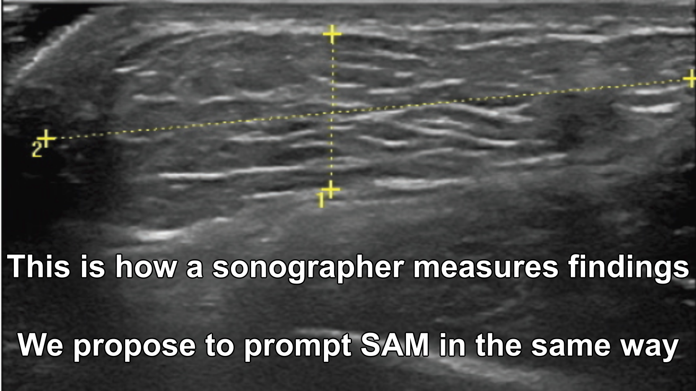
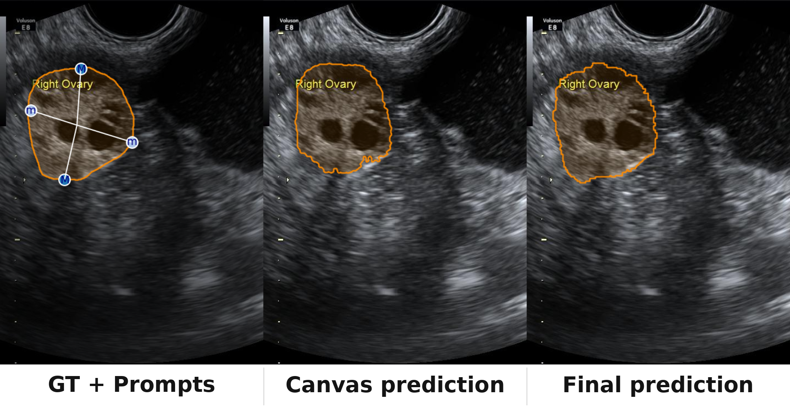
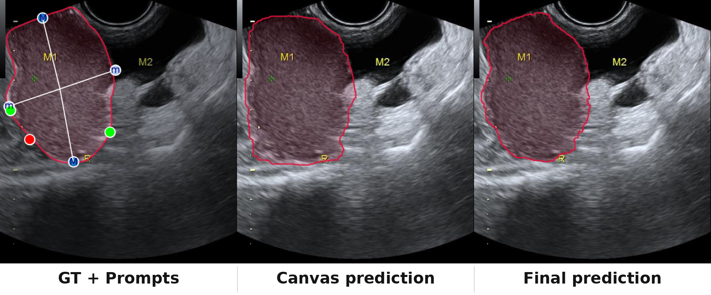
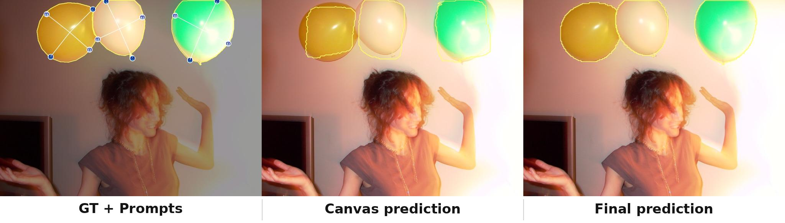

# **S4M: 4-points to Segment Anything**
### *Prompting SAM like a Sonographer*

_Adrien Meyer, Lorenzo Arboit, Giuseppe Massimiani, Shih-Min Yin, Didier Mutter, Nicolas Padoy_

[](https://arxiv.org/abs/2503.05534)

This article will be presented at IPCAI 2026, Nagoya, Japan



## Install
<details>
<summary>Click to expand Install</summary>

This guide you to install S4M in a conda env

Clone the repo
```bash
git clone https://github.com/CAMMA-public/S4M
cd S4M
```

Create a conda environment and activate it. (Tested with cuda-11.8 & gcc-12)
```bash
conda create --name S4M python=3.10.16 -y
conda activate S4M
```

Install the OpenMMLab suite and other dependencies. Building mmcv may take a few minutes.

```bash
pip install setuptools==65.0.0
pip install --no-cache-dir --force-reinstall "numpy==2.1.2"

pip install torch==2.7.1 torchvision==0.22.1 torchaudio==2.7.1 --index-url https://download.pytorch.org/whl/cu118
pip install -U openmim
mim install mmengine
mim install "mmcv==2.1.0" --no-build-isolation
mim install mmdet
mim install mmpretrain
pip install tensorboard

pip install scikit-learn scikit-image
```

Download the pretrained checkpoints, endoscapes (endoscopic surgery) and mmotu (ultrasound)
```bash
wget -O ./endoscapes_majmin.pth "https://s3.unistra.fr/camma_public/github/S4M/endoscapes_majmin.pth"
wget -O ./mmotu_majmin.pth "https://s3.unistra.fr/camma_public/github/S4M/mmotu_majmin.pth"
```
</details>

## Testing the model (ultrasound)
<details>
<summary>Click to expand Testing</summary>

To test on sample MMOTU datasets, using ```model.num_mask_refinements=0``` extra points (ie only the 4 major/minor points)
```bash
export PYTHONPATH=$PYTHONPATH:.
export TORCH_FORCE_NO_WEIGHTS_ONLY_LOAD=1
mim test mmdet S4M/configs/S4M/mmotu_majmin.py --checkpoint mmotu_majmin.pth --cfg-options model.num_mask_refinements=0 --work-dir ./work_dir/example --show-dir ./show_dir
```

in the work_dir, you will find a "show_dir" with the predictions.



To test on sample MMOTU datasets, using ```model.num_mask_refinements=3```, meaning 3 extra points are added to the 4 major/minor points as successive positive (green) or negative (red) correction points.
```bash
mim test mmdet S4M/configs/S4M/mmotu_majmin.py --checkpoint mmotu_majmin.pth --cfg-options model.num_mask_refinements=3 --work-dir ./work_dir/example --show-dir ./show_dir
```



</details>

## Custom training
<details>
<summary>Click to expand Custom training</summary>

Lets download a small custom dataset in ```./data```, "balloons"

```bash
python S4M/tools/dl_balloons.py
```


Lets finetune S4M. We modify the training config inline. You can also create a custom config file instead.
```bash
export PYTHONPATH=$PYTHONPATH:.
export TORCH_FORCE_NO_WEIGHTS_ONLY_LOAD=1

mim train mmdet S4M/configs/S4M/endoscapes_majmin.py \
  --work-dir ./work_dir/balloon_train \
  --cfg-options \
    load_from=endoscapes_majmin.pth \
    resume=False \
    train_dataloader.batch_size=2 \
    train_dataloader.dataset.data_root=data/balloon \
    train_dataloader.dataset.ann_file=train/annotation_coco_rle.json \
    train_dataloader.dataset.data_prefix.img=train \
    train_dataloader.dataset.metainfo.classes="('background','balloon')" \
    val_dataloader.dataset.data_root=data/balloon \
    val_dataloader.dataset.ann_file=val/annotation_coco_rle.json \
    val_dataloader.dataset.data_prefix.img=val \
    val_dataloader.dataset.metainfo.classes="('background','balloon')" \
    test_dataloader.dataset.data_root=data/balloon \
    test_dataloader.dataset.ann_file=val/annotation_coco_rle.json \
    test_dataloader.dataset.data_prefix.img=val \
    test_dataloader.dataset.metainfo.classes="('background','balloon')" \
    val_evaluator.0.ann_file=data/balloon/val/annotation_coco_rle.json \
    val_evaluator.1.ann_file=data/balloon/val/annotation_coco_rle.json \
    test_evaluator.0.ann_file=data/balloon/val/annotation_coco_rle.json \
    test_evaluator.1.ann_file=data/balloon/val/annotation_coco_rle.json \
    optim_wrapper.optimizer.lr=1e-5 \
    train_cfg.max_iters=200 \
    train_cfg.val_interval=100 \
    param_scheduler.0.end=100 \
    param_scheduler.1.end=200 \
    param_scheduler.1.milestones="[100,150]"
```

Lets test the model!
```bash
CKPT=$(cat work_dir/balloon_train/last_checkpoint)

mim test mmdet S4M/configs/S4M/endoscapes_majmin.py \
  --checkpoint "$CKPT" \
  --cfg-options \
    test_dataloader.dataset.data_root=data/balloon \
    test_dataloader.dataset.ann_file=val/annotation_coco_rle.json \
    test_dataloader.dataset.data_prefix.img=val \
    test_dataloader.dataset.metainfo.classes="('background','balloon')" \
    test_evaluator.0.ann_file=data/balloon/val/annotation_coco_rle.json \
    test_evaluator.1.ann_file=data/balloon/val/annotation_coco_rle.json \
    model.num_mask_refinements=0 \
  --work-dir ./work_dir/balloon_test \
  --show-dir ./show_dir
```



</details>

## References

If you find our work helpful for your research, please consider citing us using the following BibTeX entry:

```bibtex
@article{meyer2025s4m,
  title={S4M: 4-points to Segment Anything},
  author={Meyer, Adrien and Arboit, Lorenzo and Massimiani, Giuseppe and Yin, Shih-Min and Mutter, Didier and Padoy, Nicolas},
  journal={arXiv preprint arXiv:2503.05534},
  year={2025}
}

```

---


